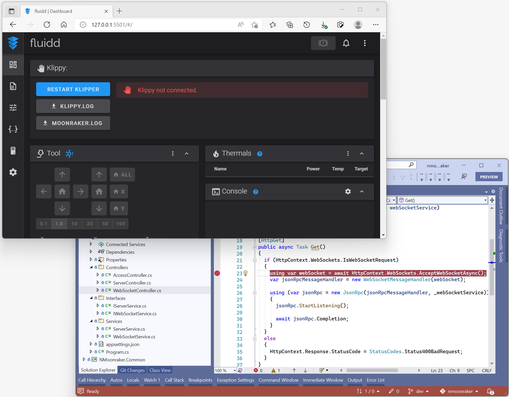

# NMoonraker
Implements Moonraker API with C# .NET, which client applications may use to interact with Klipper. 

#  Moonraker - API Web Server for Klipper

Moonraker is a Python 3 based web server that exposes APIs with which
client applications may use to interact with
[Klipper](https://github.com/KevinOConnor/klipper). Communcation between
the Klippy host and Moonraker is done over a Unix Domain Socket.  Tornado
is used to provide Moonraker's server functionality.

Documentation for users and developers can be found on
[Read the Docs](https://moonraker.readthedocs.io/en/latest/).

### Clients

Note that Moonraker does not come bundled with a client, you will need to
install one.  The following clients are currently available:

- [Mainsail](https://github.com/mainsail-crew/mainsail) by [Mainsail-Crew](https://github.com/mainsail-crew)
- [Fluidd](https://github.com/fluidd-core/fluidd) by Cadriel
- [KlipperScreen](https://github.com/jordanruthe/KlipperScreen) by jordanruthe
- [mooncord](https://github.com/eliteSchwein/mooncord) by eliteSchwein

### **❗ Notes:**

  - 2022-03-18 Fluidd can start with it, even though it is dummy data.
  